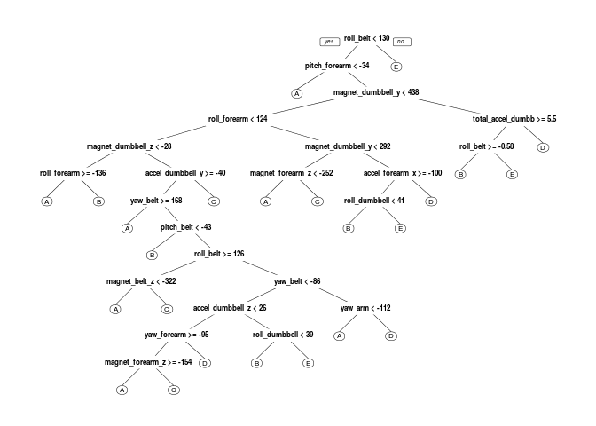

# Practical Machine Learning Project
Alan Zablocki  
June 15, 2016  


## Setting up

We load the required libraries.

```r
library(caret)
```

```
## Loading required package: lattice
```

```
## Loading required package: ggplot2
```

```r
library(randomForest)
```

```
## randomForest 4.6-12
```

```
## Type rfNews() to see new features/changes/bug fixes.
```

```
## 
## Attaching package: 'randomForest'
```

```
## The following object is masked from 'package:ggplot2':
## 
##     margin
```

```r
library(rattle)
```

```
## Rattle: A free graphical interface for data mining with R.
## Version 4.1.0 Copyright (c) 2006-2015 Togaware Pty Ltd.
## Type 'rattle()' to shake, rattle, and roll your data.
```

```r
library(rpart)
library(rpart.plot)
library(corrplot)
```
Load local data.

```r
training = read.csv("pml-training.csv")
testing = read.csv("pml-testing.csv")
```
Check the dimensions.

```r
dim(training)
```

```
## [1] 19622   160
```

```r
dim(testing)
```

```
## [1]  20 160
```
Find out how many NA values using complete.cases()

```r
sum(complete.cases(training))
```

```
## [1] 406
```
## Cleaning the data

We will remove columsn with NA values, columns with data that is not needed for training,e.g., names and time stamps etc.

We remove columsn with NA values like this:

```r
train_cleaned <- training[, colSums(is.na(training)) == 0]
```
There are seven columns at the beginning with information we do not need

```r
sum(grepl("^X|user_name|timestamp|window",names(train_cleaned)))
```

```
## [1] 7
```

```r
remove_train_col <- grepl("^X|user_name|timestamp|window",names(train_cleaned))
train_cleaned <- train_cleaned[,!remove_train_col]
ncol(train_cleaned)
```

```
## [1] 86
```
We are left with 86 columns but some have no values, and so we remove those too. Our "classe" variable will be removed but we column bind it back and make sure it is still called "class". 

```r
trClean <- train_cleaned[, sapply(train_cleaned, is.numeric)]
trained <- cbind(trClean,train_cleaned[,"classe"])
names(trained)[53] <- "classe"
colnames(trained)
```

```
##  [1] "roll_belt"            "pitch_belt"           "yaw_belt"            
##  [4] "total_accel_belt"     "gyros_belt_x"         "gyros_belt_y"        
##  [7] "gyros_belt_z"         "accel_belt_x"         "accel_belt_y"        
## [10] "accel_belt_z"         "magnet_belt_x"        "magnet_belt_y"       
## [13] "magnet_belt_z"        "roll_arm"             "pitch_arm"           
## [16] "yaw_arm"              "total_accel_arm"      "gyros_arm_x"         
## [19] "gyros_arm_y"          "gyros_arm_z"          "accel_arm_x"         
## [22] "accel_arm_y"          "accel_arm_z"          "magnet_arm_x"        
## [25] "magnet_arm_y"         "magnet_arm_z"         "roll_dumbbell"       
## [28] "pitch_dumbbell"       "yaw_dumbbell"         "total_accel_dumbbell"
## [31] "gyros_dumbbell_x"     "gyros_dumbbell_y"     "gyros_dumbbell_z"    
## [34] "accel_dumbbell_x"     "accel_dumbbell_y"     "accel_dumbbell_z"    
## [37] "magnet_dumbbell_x"    "magnet_dumbbell_y"    "magnet_dumbbell_z"   
## [40] "roll_forearm"         "pitch_forearm"        "yaw_forearm"         
## [43] "total_accel_forearm"  "gyros_forearm_x"      "gyros_forearm_y"     
## [46] "gyros_forearm_z"      "accel_forearm_x"      "accel_forearm_y"     
## [49] "accel_forearm_z"      "magnet_forearm_x"     "magnet_forearm_y"    
## [52] "magnet_forearm_z"     "classe"
```
We also check if any of the variables have near zero variance.

```r
mydata <- nearZeroVar(trained, saveMetrics = TRUE)
mydata
```

```
##                      freqRatio percentUnique zeroVar   nzv
## roll_belt             1.101904     6.7781062   FALSE FALSE
## pitch_belt            1.036082     9.3772296   FALSE FALSE
## yaw_belt              1.058480     9.9734991   FALSE FALSE
## total_accel_belt      1.063160     0.1477933   FALSE FALSE
## gyros_belt_x          1.058651     0.7134849   FALSE FALSE
## gyros_belt_y          1.144000     0.3516461   FALSE FALSE
## gyros_belt_z          1.066214     0.8612782   FALSE FALSE
## accel_belt_x          1.055412     0.8357966   FALSE FALSE
## accel_belt_y          1.113725     0.7287738   FALSE FALSE
## accel_belt_z          1.078767     1.5237998   FALSE FALSE
## magnet_belt_x         1.090141     1.6664968   FALSE FALSE
## magnet_belt_y         1.099688     1.5187035   FALSE FALSE
## magnet_belt_z         1.006369     2.3290184   FALSE FALSE
## roll_arm             52.338462    13.5256345   FALSE FALSE
## pitch_arm            87.256410    15.7323412   FALSE FALSE
## yaw_arm              33.029126    14.6570176   FALSE FALSE
## total_accel_arm       1.024526     0.3363572   FALSE FALSE
## gyros_arm_x           1.015504     3.2769341   FALSE FALSE
## gyros_arm_y           1.454369     1.9162165   FALSE FALSE
## gyros_arm_z           1.110687     1.2638875   FALSE FALSE
## accel_arm_x           1.017341     3.9598410   FALSE FALSE
## accel_arm_y           1.140187     2.7367241   FALSE FALSE
## accel_arm_z           1.128000     4.0362858   FALSE FALSE
## magnet_arm_x          1.000000     6.8239731   FALSE FALSE
## magnet_arm_y          1.056818     4.4439914   FALSE FALSE
## magnet_arm_z          1.036364     6.4468454   FALSE FALSE
## roll_dumbbell         1.022388    84.2065029   FALSE FALSE
## pitch_dumbbell        2.277372    81.7449801   FALSE FALSE
## yaw_dumbbell          1.132231    83.4828254   FALSE FALSE
## total_accel_dumbbell  1.072634     0.2191418   FALSE FALSE
## gyros_dumbbell_x      1.003268     1.2282132   FALSE FALSE
## gyros_dumbbell_y      1.264957     1.4167771   FALSE FALSE
## gyros_dumbbell_z      1.060100     1.0498420   FALSE FALSE
## accel_dumbbell_x      1.018018     2.1659362   FALSE FALSE
## accel_dumbbell_y      1.053061     2.3748853   FALSE FALSE
## accel_dumbbell_z      1.133333     2.0894914   FALSE FALSE
## magnet_dumbbell_x     1.098266     5.7486495   FALSE FALSE
## magnet_dumbbell_y     1.197740     4.3012945   FALSE FALSE
## magnet_dumbbell_z     1.020833     3.4451126   FALSE FALSE
## roll_forearm         11.589286    11.0895933   FALSE FALSE
## pitch_forearm        65.983051    14.8557741   FALSE FALSE
## yaw_forearm          15.322835    10.1467740   FALSE FALSE
## total_accel_forearm   1.128928     0.3567424   FALSE FALSE
## gyros_forearm_x       1.059273     1.5187035   FALSE FALSE
## gyros_forearm_y       1.036554     3.7763735   FALSE FALSE
## gyros_forearm_z       1.122917     1.5645704   FALSE FALSE
## accel_forearm_x       1.126437     4.0464784   FALSE FALSE
## accel_forearm_y       1.059406     5.1116094   FALSE FALSE
## accel_forearm_z       1.006250     2.9558659   FALSE FALSE
## magnet_forearm_x      1.012346     7.7667924   FALSE FALSE
## magnet_forearm_y      1.246914     9.5403119   FALSE FALSE
## magnet_forearm_z      1.000000     8.5771073   FALSE FALSE
## classe                1.469581     0.0254816   FALSE FALSE
```
Since all the variables return FALSE, we are left with 52 variables to build our model. Before this we apply the same cleaning procedures to the final testing dataset with 20 cases.


```r
test_cleaned <- testing[, colSums(is.na(testing)) == 0]
remove_test_col <- grepl("^X|user_name|timestamp|window",names(test_cleaned))
test_cleaned <- test_cleaned[,!remove_test_col]
testClean <- test_cleaned[, sapply(test_cleaned, is.numeric)]
dim(testClean)
```

```
## [1] 20 53
```

```r
dim(trClean)
```

```
## [1] 19622    52
```
We should also make sure the training and test datasets have same
columns/names.

```r
names(test_cleaned) == names(trained)
```

```
##  [1]  TRUE  TRUE  TRUE  TRUE  TRUE  TRUE  TRUE  TRUE  TRUE  TRUE  TRUE
## [12]  TRUE  TRUE  TRUE  TRUE  TRUE  TRUE  TRUE  TRUE  TRUE  TRUE  TRUE
## [23]  TRUE  TRUE  TRUE  TRUE  TRUE  TRUE  TRUE  TRUE  TRUE  TRUE  TRUE
## [34]  TRUE  TRUE  TRUE  TRUE  TRUE  TRUE  TRUE  TRUE  TRUE  TRUE  TRUE
## [45]  TRUE  TRUE  TRUE  TRUE  TRUE  TRUE  TRUE  TRUE FALSE
```
Last column names is different, but that is OK. 

## Building predictions
We split data intro training and testing samples, and set a unique seed
so we can reproduce the results. We will use 65 35 split for training and testing.


```r
set.seed(83912)
inTrain <- createDataPartition(y=trained$clas,p=0.65, list=FALSE)
my_training <- trained[inTrain,]
my_testing <- trained[-inTrain,]
```

### Predicting with decision trees

```r
model_Dtree <- rpart(classe ~.,data = my_training, method = "class")
prediction_Dtree <- predict(model_Dtree, my_testing, type = "class")
confusionMatrix(prediction_Dtree, my_testing$classe)
```

```
## Confusion Matrix and Statistics
## 
##           Reference
## Prediction    A    B    C    D    E
##          A 1776  210   22   49   20
##          B   55  721   48   91   83
##          C   44  197  978  177  152
##          D   21  101   68  705   62
##          E   57   99   81  103  945
## 
## Overall Statistics
##                                           
##                Accuracy : 0.7465          
##                  95% CI : (0.7361, 0.7568)
##     No Information Rate : 0.2845          
##     P-Value [Acc > NIR] : < 2.2e-16       
##                                           
##                   Kappa : 0.6789          
##  Mcnemar's Test P-Value : < 2.2e-16       
## 
## Statistics by Class:
## 
##                      Class: A Class: B Class: C Class: D Class: E
## Sensitivity            0.9094   0.5429   0.8170   0.6267   0.7488
## Specificity            0.9387   0.9500   0.8994   0.9561   0.9393
## Pos Pred Value         0.8551   0.7224   0.6318   0.7367   0.7354
## Neg Pred Value         0.9630   0.8965   0.9588   0.9289   0.9432
## Prevalence             0.2845   0.1934   0.1744   0.1639   0.1838
## Detection Rate         0.2587   0.1050   0.1425   0.1027   0.1377
## Detection Prevalence   0.3025   0.1454   0.2255   0.1394   0.1872
## Balanced Accuracy      0.9240   0.7464   0.8582   0.7914   0.8441
```

```r
model_Dtree
```

```
## n= 12757 
## 
## node), split, n, loss, yval, (yprob)
##       * denotes terminal node
## 
##     1) root 12757 9130 A (0.28 0.19 0.17 0.16 0.18)  
##       2) roll_belt< 129.5 11642 8057 A (0.31 0.21 0.19 0.18 0.11)  
##         4) pitch_forearm< -33.95 1005    6 A (0.99 0.006 0 0 0) *
##         5) pitch_forearm>=-33.95 10637 8051 A (0.24 0.23 0.21 0.2 0.12)  
##          10) magnet_dumbbell_y< 438.5 8968 6442 A (0.28 0.18 0.24 0.19 0.11)  
##            20) roll_forearm< 123.5 5610 3360 A (0.4 0.19 0.18 0.17 0.061)  
##              40) magnet_dumbbell_z< -27.5 1874  620 A (0.67 0.21 0.012 0.078 0.034)  
##                80) roll_forearm>=-136.5 1554  333 A (0.79 0.17 0.013 0.028 0.0058) *
##                81) roll_forearm< -136.5 320  193 B (0.1 0.4 0.0094 0.32 0.17) *
##              41) magnet_dumbbell_z>=-27.5 3736 2740 A (0.27 0.17 0.26 0.22 0.074)  
##                82) accel_dumbbell_y>=-40.5 3327 2334 A (0.3 0.19 0.18 0.24 0.083)  
##                 164) yaw_belt>=168.5 484   74 A (0.85 0.087 0.0021 0.06 0.0041) *
##                 165) yaw_belt< 168.5 2843 2058 D (0.21 0.21 0.21 0.28 0.096)  
##                   330) pitch_belt< -43.15 302   36 B (0.0066 0.88 0.07 0.02 0.023) *
##                   331) pitch_belt>=-43.15 2541 1762 D (0.23 0.13 0.23 0.31 0.1)  
##                     662) roll_belt>=125.5 546  226 C (0.35 0.049 0.59 0.011 0)  
##                      1324) magnet_belt_z< -322.5 163    3 A (0.98 0.0061 0.012 0 0) *
##                      1325) magnet_belt_z>=-322.5 383   65 C (0.086 0.068 0.83 0.016 0) *
##                     663) roll_belt< 125.5 1995 1222 D (0.19 0.15 0.13 0.39 0.13)  
##                      1326) yaw_belt< -85.55 1241  948 A (0.24 0.21 0.14 0.22 0.19)  
##                        2652) accel_dumbbell_z< 25.5 769  490 A (0.36 0.14 0.22 0.24 0.033)  
##                          5304) yaw_forearm>=-94.55 569  290 A (0.49 0.18 0.24 0.053 0.032)  
##                           10608) magnet_forearm_z>=-154.5 358   84 A (0.77 0.14 0.02 0.039 0.034) *
##                           10609) magnet_forearm_z< -154.5 211   80 C (0.024 0.25 0.62 0.076 0.028) *
##                          5305) yaw_forearm< -94.55 200   44 D (0 0.025 0.16 0.78 0.035) *
##                        2653) accel_dumbbell_z>=25.5 472  264 E (0.03 0.33 0.013 0.19 0.44)  
##                          5306) roll_dumbbell< 38.68377 157   32 B (0.032 0.8 0.038 0.025 0.11) *
##                          5307) roll_dumbbell>=38.68377 315  124 E (0.029 0.098 0 0.27 0.61) *
##                      1327) yaw_belt>=-85.55 754  255 D (0.13 0.048 0.12 0.66 0.044)  
##                        2654) yaw_arm< -112.35 92    0 A (1 0 0 0 0) *
##                        2655) yaw_arm>=-112.35 662  163 D (0.0045 0.054 0.14 0.75 0.05) *
##                83) accel_dumbbell_y< -40.5 409   36 C (0.0073 0.042 0.91 0.034 0.0049) *
##            21) roll_forearm>=123.5 3358 2216 C (0.082 0.17 0.34 0.22 0.18)  
##              42) magnet_dumbbell_y< 291.5 1988 1002 C (0.1 0.12 0.5 0.15 0.14)  
##                84) magnet_forearm_z< -251.5 157   31 A (0.8 0.07 0 0.038 0.089) *
##                85) magnet_forearm_z>=-251.5 1831  845 C (0.039 0.13 0.54 0.16 0.14) *
##              43) magnet_dumbbell_y>=291.5 1370  913 D (0.057 0.24 0.11 0.33 0.26)  
##                86) accel_forearm_x>=-100.5 880  572 E (0.051 0.31 0.15 0.14 0.35)  
##                 172) roll_dumbbell< 41.02769 180   36 B (0.056 0.8 0.011 0.039 0.094) *
##                 173) roll_dumbbell>=41.02769 700  409 E (0.05 0.18 0.19 0.16 0.42) *
##                87) accel_forearm_x< -100.5 490  153 D (0.067 0.12 0.041 0.69 0.088) *
##          11) magnet_dumbbell_y>=438.5 1669  817 B (0.036 0.51 0.047 0.22 0.19)  
##            22) total_accel_dumbbell>=5.5 1218  439 B (0.049 0.64 0.063 0.021 0.23)  
##              44) roll_belt>=-0.58 1030  251 B (0.058 0.76 0.075 0.024 0.086) *
##              45) roll_belt< -0.58 188    0 E (0 0 0 0 1) *
##            23) total_accel_dumbbell< 5.5 451  108 D (0 0.16 0.0022 0.76 0.075) *
##       3) roll_belt>=129.5 1115   42 E (0.038 0 0 0 0.96) *
```
I find that decision trees are not good enough to get the sort of accuracy we are after. Therefore I will try random forests now.
### Predicting with random forests

```r
model_RF1 <- randomForest(classe ~., data = my_training)
prediction_RF1 <- predict(model_RF1, my_testing, type = "class")
confusionMatrix(prediction_RF1, my_testing$classe)
```

```
## Confusion Matrix and Statistics
## 
##           Reference
## Prediction    A    B    C    D    E
##          A 1951    3    0    1    0
##          B    2 1320   13    0    0
##          C    0    5 1184   15    2
##          D    0    0    0 1108    1
##          E    0    0    0    1 1259
## 
## Overall Statistics
##                                           
##                Accuracy : 0.9937          
##                  95% CI : (0.9916, 0.9955)
##     No Information Rate : 0.2845          
##     P-Value [Acc > NIR] : < 2.2e-16       
##                                           
##                   Kappa : 0.9921          
##  Mcnemar's Test P-Value : NA              
## 
## Statistics by Class:
## 
##                      Class: A Class: B Class: C Class: D Class: E
## Sensitivity            0.9990   0.9940   0.9891   0.9849   0.9976
## Specificity            0.9992   0.9973   0.9961   0.9998   0.9998
## Pos Pred Value         0.9980   0.9888   0.9818   0.9991   0.9992
## Neg Pred Value         0.9996   0.9986   0.9977   0.9970   0.9995
## Prevalence             0.2845   0.1934   0.1744   0.1639   0.1838
## Detection Rate         0.2842   0.1923   0.1725   0.1614   0.1834
## Detection Prevalence   0.2848   0.1945   0.1757   0.1615   0.1835
## Balanced Accuracy      0.9991   0.9956   0.9926   0.9924   0.9987
```

```r
model_RF1
```

```
## 
## Call:
##  randomForest(formula = classe ~ ., data = my_training) 
##                Type of random forest: classification
##                      Number of trees: 500
## No. of variables tried at each split: 7
## 
##         OOB estimate of  error rate: 0.55%
## Confusion matrix:
##      A    B    C    D    E class.error
## A 3621    5    1    0    0 0.001654260
## B   12 2453    4    0    0 0.006480356
## C    0   13 2209    3    0 0.007191011
## D    0    0   20 2069    2 0.010521282
## E    0    0    3    7 2335 0.004264392
```
When running RF with 500 trees we get a very good accuracy of about 99.4 percent. I find that this does not vary much if we reduce the number of trees to 100 (Acc = 0.9932). Adding k-fold cross-validation does not improve the result. Pre-processing (centering and scaling) also does not change the result.
### Adding cross validation

```r
control <- trainControl(method = "cv",5)
model_RF2 <- train(classe ~., data = my_training, method = "rf",trControl=control, ntree=100)
prediction_RF2 <- predict(model_RF2, my_testing)
confusionMatrix(prediction_RF2, my_testing$classe)
```

```
## Confusion Matrix and Statistics
## 
##           Reference
## Prediction    A    B    C    D    E
##          A 1949    6    0    0    0
##          B    4 1315   10    1    2
##          C    0    7 1181   13    5
##          D    0    0    6 1111    0
##          E    0    0    0    0 1255
## 
## Overall Statistics
##                                           
##                Accuracy : 0.9921          
##                  95% CI : (0.9897, 0.9941)
##     No Information Rate : 0.2845          
##     P-Value [Acc > NIR] : < 2.2e-16       
##                                           
##                   Kappa : 0.99            
##  Mcnemar's Test P-Value : NA              
## 
## Statistics by Class:
## 
##                      Class: A Class: B Class: C Class: D Class: E
## Sensitivity            0.9980   0.9902   0.9866   0.9876   0.9945
## Specificity            0.9988   0.9969   0.9956   0.9990   1.0000
## Pos Pred Value         0.9969   0.9872   0.9793   0.9946   1.0000
## Neg Pred Value         0.9992   0.9977   0.9972   0.9976   0.9988
## Prevalence             0.2845   0.1934   0.1744   0.1639   0.1838
## Detection Rate         0.2839   0.1916   0.1720   0.1618   0.1828
## Detection Prevalence   0.2848   0.1940   0.1757   0.1627   0.1828
## Balanced Accuracy      0.9984   0.9936   0.9911   0.9933   0.9972
```

```r
model_RF2
```

```
## Random Forest 
## 
## 12757 samples
##    52 predictors
##     5 classes: 'A', 'B', 'C', 'D', 'E' 
## 
## No pre-processing
## Resampling: Cross-Validated (5 fold) 
## Summary of sample sizes: 10206, 10205, 10205, 10206, 10206 
## Resampling results across tuning parameters:
## 
##   mtry  Accuracy   Kappa    
##    2    0.9891044  0.9862154
##   27    0.9909853  0.9885956
##   52    0.9830681  0.9785807
## 
## Accuracy was used to select the optimal model using  the largest value.
## The final value used for the model was mtry = 27.
```
I can work out the accuracy and out of sample error on the RF1 model, which I also apply to the final test set.

```r
accuracy <- postResample(prediction_RF1, my_testing$classe)
accuracy
```

```
##  Accuracy     Kappa 
## 0.9937363 0.9920766
```

```r
OutSampleErr <- 1- as.numeric(confusionMatrix(prediction_RF1, my_testing$classe)$overall[1])
OutSampleErr
```

```
## [1] 0.006263656
```
Running this on the test set for the quiz

```r
fin_results <- predict(model_RF1,test_cleaned[,-length(names(test_cleaned))])
fin_results
```

```
##  1  2  3  4  5  6  7  8  9 10 11 12 13 14 15 16 17 18 19 20 
##  B  A  B  A  A  E  D  B  A  A  B  C  B  A  E  E  A  B  B  B 
## Levels: A B C D E
```
# Plots

```r
plot(model_RF1)
```

<!-- -->
## Correlation matrix

```r
corrPlot <- cor(my_training[, -length(names(my_training))])
corrplot(corrPlot, method="color")
```

<!-- -->
## Decision Tree

```r
prp(model_Dtree)
```

<!-- -->

```r
fancyRpartPlot(model_Dtree)
```

<!-- -->
